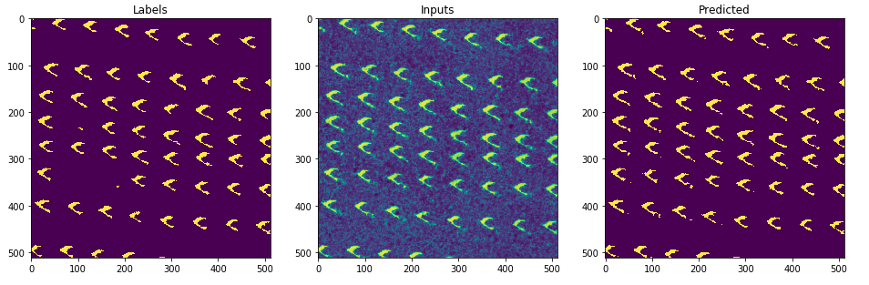

# Introduction
A model with U-Net like architecture for semantic segmentation of
imaging mass spectrometry ablation marks on microscopy images.
The model is based on [TernausNet](https://github.com/ternaus/TernausNet)
and [https://arxiv.org/abs/1801.05746](https://arxiv.org/abs/1801.05746)

Example of model segmentation results



# Setup
To explore the segmentation model training Jupyter notebook:
* Create and activate conda environment using `environment-gpu.yml` file
* Spin up Jupyter server and open `unet.ipynb` notebook

To use the API built for image segmentation:
* Create and activate conda environment using `environment-cpu.yml` file
* Install `redis-server` to use it as a queue for segmentation tasks
* Spin up `gunicorn` to serve the REST API
```
gunicorn --reload 'api.app:get_app()'
```
* The API will be available on localhost:8000

# Docker
TODO

# Using API

* Spin up gunicorn
* Submit a segmentation task
```
http POST localhost:8000/tasks Content-Type:image/png < api-use/source_small.png

HTTP/1.0 201 Created
Date: Mon, 07 Jan 2019 22:48:58 GMT
Server: WSGIServer/0.2 CPython/3.7.2
content-length: 0
content-type: application/json; charset=UTF-8
location: /tasks/c0bfec01-a8a4-431b-8d3d-56e43708c877
```
* Check task status
```
http localhost:8000/tasks/c0bfec01-a8a4-431b-8d3d-56e43708c877

HTTP/1.0 200 OK
Date: Mon, 07 Jan 2019 22:49:51 GMT
Server: WSGIServer/0.2 CPython/3.7.2
content-length: 20
content-type: application/json; charset=UTF-8

{
    "status": "QUEUED"
}
```
* Once status is "FINISHED", get predicted mask
```
http localhost:8000/masks/c0bfec01-a8a4-431b-8d3d-56e43708c877

HTTP/1.0 200 OK
Date: Mon, 07 Jan 2019 22:52:30 GMT
Server: WSGIServer/0.2 CPython/3.7.2
content-length: 171167
content-type: image/png

+-----------------------------------------+
| NOTE: binary data not shown in terminal |
+-----------------------------------------+

```