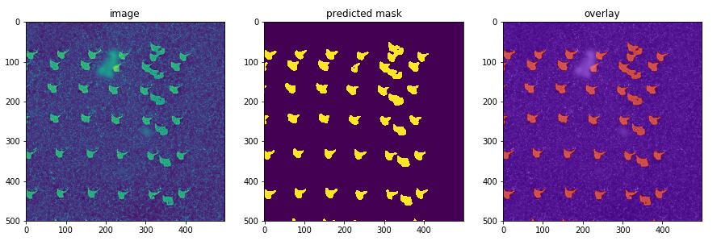
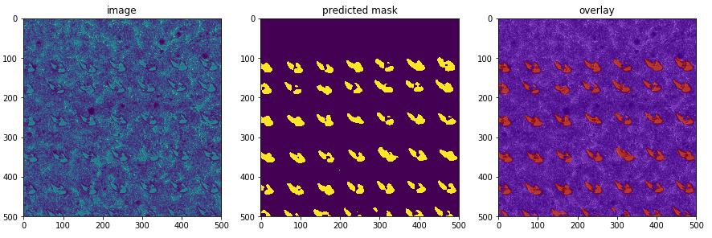
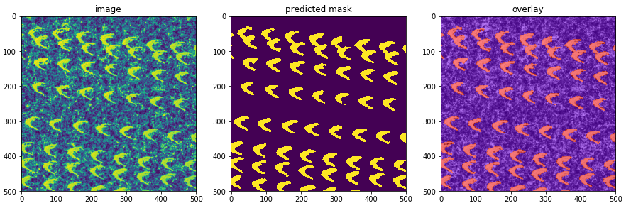

# Introduction
A model with U-Net like architecture for semantic segmentation of
imaging mass spectrometry ablation marks on microscopy images.
The models are based on [TernausNet](https://github.com/ternaus/TernausNet)
and [segmentation_models.pytorch](https://github.com/qubvel/segmentation_models.pytorch)

Image segmentation results:




# Data
The model training was done on a wide range of different images obtained from 
microscopy of samples after acquisition with imaging mass spectrometry.

Sample data can be downloaded from AWS S3 using
```
wget https://am-segm.s3-eu-west-1.amazonaws.com/post-MALDI-IMS-microscopy.tar.gz
```

It is important to notice that usually these microscopy images are quite large, e.g.
5000x5000 pixels. As most of the segmentation networks are not designed for images
of such resolution, additional steps for image slicing and stitching
have to be added to the pipeline.   

# Training

The best performing model turned to be U-net with
[ResNeXt-50 (32x4d)](https://arxiv.org/abs/1611.05431) as encoder from
[segmentation_models.pytorch](https://github.com/qubvel/segmentation_models.pytorch)
by Pavel Yakubovskiy

### Pseudo-labeling

As original data usually does not come with masks, a semi-supervised approach for
getting image masks is used.
* Fist a few small areas of the input image are selected and manually segmented
* Simple and fast model with lots of regularisation to prevent overfitting is trained
* The trained model is used to predict full mask for the image
* The full mask for multiple images already can be used for more intensive training
of a bigger model

### Notebooks

To explore the model training Jupyter notebook:
* Install dependencies `pip install -r requirements.txt`
* Spin up Jupyter server and open `pytorch-unet.ipynb` notebook

# Inference

### AWS Elastic Container Service

* Build a Docker image from `ecs` directory and push it to an image repository
* Create a ECS task definition, input and output S3 buckets, and an AWS SQS queue
* Create `config/config.yml` file from template.
Put all required configuration variables there
* Start the segmentation pipeline
```
python am/pipeline data/inference/dataset --rows 50 --cols 50
```

### AWS SageMaker

* Build a Docker image from `sagemaker` directory and push it to the AWS container repository
* Upload model file to an S3 bucket
* Create a SageMaker batch job using `sagemaker-batch-job-example.py` 

### Simple API in Docker

* Build image and start container
```
docker build -t am-segm -f docker/Dockerfile .
docker run -d -p 8000:8000 --name am-segm am-segm
```

* Submit a segmentation task
```
http POST localhost:8000/tasks Content-Type:image/png < api-use/source_small.png

HTTP/1.0 201 Created
Date: Mon, 07 Jan 2019 22:48:58 GMT
Server: WSGIServer/0.2 CPython/3.7.2
content-length: 0
content-type: application/json; charset=UTF-8
location: /tasks/c0bfec01-a8a4-431b-8d3d-56e43708c877
```
* Check task status
```
http localhost:8000/tasks/c0bfec01-a8a4-431b-8d3d-56e43708c877

HTTP/1.0 200 OK
Date: Mon, 07 Jan 2019 22:49:51 GMT
Server: WSGIServer/0.2 CPython/3.7.2
content-length: 20
content-type: application/json; charset=UTF-8

{
    "status": "QUEUED"
}
```
* Once status is "FINISHED", get predicted mask
```
http localhost:8000/masks/c0bfec01-a8a4-431b-8d3d-56e43708c877

HTTP/1.0 200 OK
Date: Mon, 07 Jan 2019 22:52:30 GMT
Server: WSGIServer/0.2 CPython/3.7.2
content-length: 171167
content-type: image/png

+-----------------------------------------+
| NOTE: binary data not shown in terminal |
+-----------------------------------------+

```
